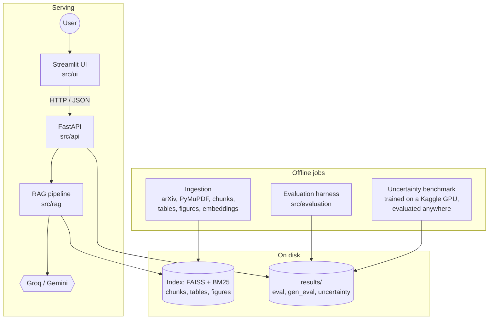
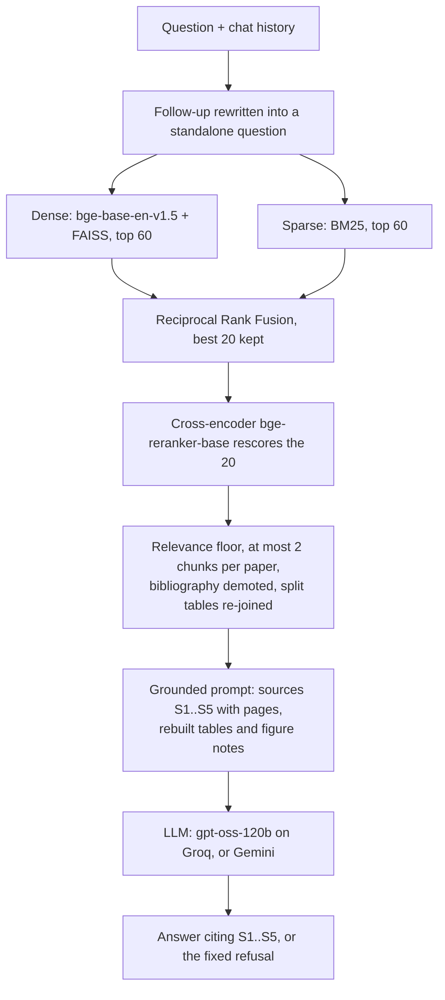

# Uncertainty-Aware Research Intelligence Platform

[](https://github.com/bhatsajid18/uncertainty-rag/actions/workflows/ci.yml)

Ask questions about machine-learning papers and get answers that cite paper and
page for every claim, or a plain "the sources don't cover this". Next to it, a
benchmark of how well four uncertainty methods know when *they* don't know.
Both are measured, not just demonstrated.

- **Research assistant (RAG).** Hybrid retrieval (bge embeddings + FAISS, BM25,
  Reciprocal Rank Fusion) and a cross-encoder reranker over 12 papers on
  uncertainty and OOD detection. Tables are rebuilt from the PDF's geometry,
  figures are extracted and described by a vision model, follow-up questions
  work, and you can upload your own PDFs.
- **Evaluation.** 87 human-reviewed questions (67 answerable, 20 unanswerable):
  Recall/MRR/nDCG with paired-bootstrap confidence intervals, abstention AUROC,
  and LLM-judged answer quality (faithfulness, citation accuracy, refusals).
- **Uncertainty benchmark.** Softmax, MC Dropout, Deep Ensemble and Evidential
  Deep Learning (ResNet-18 on CIFAR-10) against far OOD (SVHN), near OOD
  (CIFAR-100) and 25 corruption settings: AUROC, AUPR, FPR@95, ECE, Brier,
  selective prediction.
- **Serving.** FastAPI backend, Streamlit frontend, Docker Compose, CI.

No LangChain or LlamaIndex: every step is plain Python that can be read, tested
and ablated. (A thin, optional LangChain adapter exposes the retriever to
LangChain apps.)

## Results

Retrieval on the 67 answerable questions (408 chunks from 12 papers; run
`results/eval/core_v3`):

| Configuration | Recall@1 | Recall@5 | Recall@10 | nDCG@5 | MRR |
|---|---|---|---|---|---|
| Dense (bge-base-en-v1.5 + FAISS) | 0.164 | 0.515 | 0.664 | 0.360 | 0.352 |
| BM25 | 0.396 | 0.575 | 0.664 | 0.514 | 0.542 |
| Hybrid (RRF) | 0.291 | 0.612 | 0.739 | 0.487 | 0.496 |
| **Hybrid + bge-reranker** (default) | **0.440** | **0.679** | **0.791** | **0.583** | **0.602** |
| Hybrid + reranker + 3 LLM rephrasings | 0.425 | 0.672 | 0.784 | 0.574 | 0.598 |

- **Hybrid + reranker vs dense:** Recall@5 **0.515 → 0.679** (+0.164, 95% CI
  [+0.045, +0.284]) and MRR **0.352 → 0.602** (+0.250, CI [+0.145, +0.355]),
  paired bootstrap over questions.
- **Knowing when to refuse:** the reranker's top score separates the 20
  unanswerable questions from the answerable ones with **AUROC 0.997** (dense
  similarity: 0.946).
- **By question type** (Recall@5, dense → default): exact terms 0.42 → 0.62,
  semantic 0.63 → 0.81, multi-paper 0.46 → 0.54.
- **What didn't help:** LLM query rephrasing costs a call per question and
  changed Recall@5 by −0.007. None of 11 reranker variants (diversity cap,
  relevance floor, candidate pool, MMR, bibliography handling) beat the default
  significantly ([per-ablation intervals](docs/DEVELOPMENT.md#9-ablation-surface-and-evaluation)).

Answer quality comes from `make eval-gen`, and the uncertainty numbers from
the Kaggle notebook ([below](#uncertainty-benchmark)). Both land in
`results/` and on the app's dashboards.

## Architecture



What happens to a question:



## Features

**1. End-to-end RAG** (`src/rag`)
- arXiv download → PyMuPDF text, cleaned of ligatures, page numbers and arXiv
  stamps → 512-token chunks (50 overlap) measured with the embedder's own
  tokenizer → bge-base embeddings in an exact FAISS index, with the paper title
  prefixed to each chunk.
- Grounded generation: numbered sources, `[S1]` citations (normalised when a
  model uses its own format), a fixed refusal string when the sources don't
  answer.
- Two LLM providers behind one interface: Groq (`gpt-oss-120b`, falls back to
  `gpt-oss-20b` on the daily limit) and Gemini (vision, its own free quota).
  Rate limits, retired model ids, 5xx errors and dropped connections are
  handled in one place (`llm.py`, `providers.py`).

**2. Retrieval that works on papers**
- BM25 + dense fused with RRF (or weighted fusion), then a cross-encoder
  reranker. Every stage is a flag, so each can be ablated.
- Bibliography chunks detected by citation density and demoted; a per-paper
  diversity cap, a relevance floor, optional MMR.
- **Tables**: rebuilt from word positions in the PDF (`table_extract.py`), or
  described by an LLM when the geometry fails (`table_notes.py`); a table split
  across chunks is re-joined at answer time.
- **Figures**: cropped to PNG with their captions (`figures.py`), optionally
  described by Gemini vision, attached to the chunks that mention them, and
  shown next to answers in the app.
- Conversation: follow-ups are rewritten into standalone questions; uploaded
  PDFs are searched alone or together with the corpus.

**3. Evaluation** (`src/evaluation`)
- A question set generated by an LLM from sampled chunks, then reviewed by hand
  (`review_queries.py`), with each relevant chunk pinned by a hash of its text
  so stale labels are refused rather than silently scored.
- Retrieval: Recall/Precision/nDCG/Success@k, MRR, per-category breakdowns,
  paired bootstrap against the dense baseline, abstention AUROC
  (`run_eval.py`, suites `core`, `ablations`, `no_llm`).
- Answers: sentence-level faithfulness and citation accuracy judged by a
  second LLM, answer relevance, correctness against evidence quotes, false
  refusals and correct abstentions (`gen_eval.py`; cached and resumable).

**4. Uncertainty and OOD** (`src/uncertainty`)
- 7 ResNet-18s: softmax (seeds 0–4, which also form the Deep Ensemble), MC
  Dropout (dropout in every block, 20 passes), EDL (Dirichlet output, digamma
  loss with annealed KL).
- Scores: max softmax probability, predictive entropy, mutual information,
  vacuity. Metrics: AUROC, AUPR-In/Out, FPR@95TPR, ECE, Brier, NLL, AURC.
- Deeper experiments: near vs far OOD, accuracy/calibration/detectability
  across 5 corruptions × 5 severities, and selective prediction
  (risk-coverage).
- Train on Kaggle's free GPUs (two GPUs in parallel), evaluate on a laptop from
  saved predictions.

**5. Serving** (`src/api`, `src/ui`, `docker/`)
- REST API with chat sessions, multipart PDF upload, figure images and the
  benchmark results; errors map to 400/404/429/503 instead of crashing.
- Streamlit app: chat with sources, tables and figures; uncertainty and
  retrieval dashboards.
- Docker Compose for both, CI on every push (lint, 250+ offline tests, a
  smoke run of the uncertainty pipeline, image builds).

## Quickstart

Needs Python 3.11 (conda is easiest), ~7 GB of disk, and a free LLM key:
[Groq](https://console.groq.com/keys) for chat and/or
[Gemini](https://aistudio.google.com/apikey) for figure descriptions and
judging. Developed on an 8 GB Apple-Silicon Mac.

```bash
git clone https://github.com/bhatsajid18/uncertainty-rag.git
cd uncertainty-rag
conda env create -f environment.yml   # creates the `rag` env with everything
conda activate rag                    # (existing env? conda activate rag && make install)
cp .env.example .env                  # then paste your key(s) into .env
make test                             # offline, under a minute
```

<details>
<summary>Without conda</summary>

```bash
python3.11 -m venv .venv && source .venv/bin/activate
pip install -r requirements-dev.txt
```
</details>

**Build the corpus** (downloads the 12 papers in `data/papers.txt` and the
embedding model on the first run; a few minutes):

```bash
make corpus        # download -> chunk -> tables -> figures -> index
```

Optional, uses LLM quota, resumable: table descriptions and figure
descriptions, then re-index to include them.

```bash
make notes
python src/rag/figures.py --describe --provider gemini
make index
```

**Ask:**

```bash
make chat          # in the terminal; `python src/rag/chat.py --pdf my.pdf` for your own PDFs
make dev           # API on :8000 (docs at /docs) + app on http://localhost:8501
```

**Or with Docker** (after `make corpus`, which builds the index the container
reads):

```bash
make docker-up     # http://localhost:8501 ; API on :8000
```

The first start downloads ~1.5 GB of models into a Docker volume; the app says
"loading the models" until they are ready. The API needs roughly 3 GB of memory:
if Docker Desktop kills it, raise the limit (*Settings → Resources*) or set
`RAG_RERANKER=cross-encoder/ms-marco-MiniLM-L-6-v2` in `.env` for a smaller
reranker (the numbers above are for bge-reranker-base).

## Uncertainty benchmark

Training needs a GPU; everything else runs on a laptop.

1. On [Kaggle](https://www.kaggle.com/code): *New Notebook → File → Import
   Notebook*, and pick `notebooks/kaggle_uncertainty.ipynb` (or its GitHub URL).
2. Settings: *Accelerator: GPU T4 x2*, *Internet: on*. Then *Save Version →
   Save & Run All*. It runs a one-minute smoke test, trains the 7 models
   (roughly an hour on two T4s), predicts on every evaluation set and zips the
   results.
3. From the notebook's *Output* tab, download `uncertainty_results.zip`, then
   in the repo:

   ```bash
   unzip -o ~/Downloads/uncertainty_results.zip
   make uncertainty-eval    # rebuilds tables + figures from the predictions
   ```

4. `results/uncertainty/report.md` has the tables, `figures/` the plots, and
   the app's *Uncertainty benchmark* page shows both. Commit
   `results/uncertainty/` (the raw predictions are gitignored).

`make uncertainty-smoke` runs the same pipeline on tiny fake data in about a
minute, to check the code without a GPU.

## Evaluation

```bash
make eval-core        # dense, bm25, hybrid, hybrid_rerank (+ multi-query) -> results/eval/<run>/
make eval-ablations   # 18 configurations
make eval-gen         # answer quality, Gemini as the judge -> results/gen_eval/gen_v1/
```

Runs are committed deliberately (`git add -f results/eval/<run>`), so only
runs on the reviewed question set are kept. Every output file is described
in [docs/DEVELOPMENT.md](docs/DEVELOPMENT.md#9-ablation-surface-and-evaluation).

The labels are pinned to the exact text of each relevant chunk, so a run on
different text is refused rather than silently mis-scored. That is why PyMuPDF
is pinned in `requirements-api.txt`. The papers are fetched by arXiv ID: if an
author posts a new version, write the indexed one in `data/papers.txt`
(`1806.01768v3`; `data/metadata.json` records it) to keep the old text.

## API

Interactive docs at `http://localhost:8000/docs`. The main endpoints:

| Method | Path | |
|---|---|---|
| GET | `/health` | status: models loaded, LLM key present |
| GET | `/papers` | the corpus |
| POST | `/search` | retrieval only: `{"query", "k", "mode"}` |
| POST | `/ask` | one question: answer + sources |
| POST | `/sessions` | start a conversation |
| POST | `/sessions/{id}/messages` | ask within it (follow-ups work) |
| POST | `/sessions/{id}/documents` | upload PDFs (`files`, `with_corpus`) |
| GET | `/results/uncertainty` | the benchmark summary |
| GET | `/results/{retrieval,generation}/{run}` | evaluation runs |

```bash
curl -s localhost:8000/ask -H 'content-type: application/json' \
  -d '{"question": "What does EDL place a Dirichlet distribution over?"}'
```

## Project structure

```
src/rag/            ingestion, index, retrieval, generation, chat, LLM providers
src/evaluation/     question set, retrieval eval, answer-quality eval
src/uncertainty/    train.py -> predict.py -> evaluate.py (+ data, models, metrics)
src/api/            FastAPI app and the service layer
src/ui/             Streamlit app and its API client
notebooks/          kaggle_uncertainty.ipynb
configs/            uncertainty.yaml
docker/, docker-compose.yml
data/               papers.txt, reviewed questions, tables/figure notes (the rest is rebuilt)
results/            evaluation runs and the benchmark results
tests/              pytest, offline: small stand-ins for models and LLMs
docs/DEVELOPMENT.md design notes, command reference, debugging log
```

## Tech stack

Python 3.11 · PyMuPDF · sentence-transformers (bge-base-en-v1.5,
bge-reranker-base) · FAISS · rank-bm25 · Groq and Gemini SDKs · PyTorch and
torchvision · FastAPI · Streamlit + Altair · Docker · pytest, ruff, GitHub
Actions.

## Development

`make help` lists every command; `make check` runs lint and tests, as CI does.
[docs/DEVELOPMENT.md](docs/DEVELOPMENT.md) has the full command reference,
the design decisions iteration by iteration, and the debugging log.
[CLAUDE.md](CLAUDE.md) has the ground rules for AI-assisted changes.

The papers are downloaded from arXiv at build time and are not redistributed
here.
